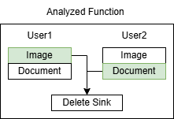
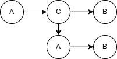

# Paralegal Experiment

This repo includes experiments for Paralegal.

## Goal

1. Understand how Paralegal is used and what might be the problem when using it.
2. Evaluate Paralegal's capability and limitations on commonly used libraries (https://crates.io/).

## Target Libraries

- [jsonwebtoken](https://github.com/Keats/jsonwebtoken/tree/master)
- [rustls](https://github.com/rustls/rustls)
- [p2panda](https://github.com/p2panda/p2panda/tree/main)

## Rust Installation

```sh
curl --proto '=https' --tlsv1.2 https://sh.rustup.rs -sSf | sh
```

## Environment

1. You should have the Rust installed, version > 1.85 (Now is 1.94.1).
2. Paralegal works on 1.84, it has defined that in `rust-toolchain` so no worry.
3. All crates in the experiments should not require the Rust version higher than 1.84.

## How to Run

Base:

1. `git clone --recursive https://github.com/syrup4u/paralegal.git`
2. `cd paralegal; cargo install --locked --path crates/paralegal-flow`
3. `cargo paralegal-flow --version`

Move to the work directory: `cd guide/policy`

Run tests with `bash run.sh [test number]`.

## Used Policies

For checking libraries:

1. `A does not go to B`: A is sensitive data, B is output sink like prinln!, dbg, format, io.write, etc.
2. `A goes to B only via C`: A is sensitive data, B is output sink, C is process like encode, sign, etc.

## Some Discovered Limitations

> Exists multiple instances that produce multiple `A`s that appear in `A goes to B`.

It lacks a way to handle this case. Refers to [exp-1](#exp-1) for more details and a reported GitHub [issue](https://github.com/brownsys/paralegal/issues/186).



> `A goes to B only via C`, but C does not change the type of A.

It cannot handle such recursion: after A being processed by C, a "new" A is "created" and thus if it goes to B, it fails because of "not via C". Figure below explains this scenario. Refers to [exp-4](#exp-4) and [exp-5](#exp-5).



## Methodology

- Scan whole libraries to identify potential leakage. (If not exists, inject one)
- A harness main as a placeholder is required since Paralegal is designed for applications rather than libraries.

## Overall Results

| Crate | LoC | Total Time | Marker | PDG / Seen Functions |
| --- | --- | --- | --- | --- |
| `jsonwebtoken` | 3,847 | 32.957 s | 6 | 10 / 849 |
| `rustls` | 67,288 | 11.909 s | 7 | 5 / 442 |

## Explanation of Experiments

| Exp | Desc |
| -- | -- |
| [Original Toy Case](#original-toy-case) | A toy case provided by Paralegal's author |
| [exp-1](#exp-1) | For limitation 1 |
| [exp-2](#exp-2) | A supplement of the official toy case |
| [exp-3](#exp-3) | Some tests for `A goes to B only via C` policy |
| [exp-4](#exp-4) | For limitation 2 |
| [exp-5](#exp-5) | For limitation 2 |
| [exp-6](#exp-6) | Some tests for cross-crate analysis and marker order |
| [exp-6-extended](#exp-6-extended) | Tests for lib: `jsonwebtoken` |
| [exp-7](#exp-7) | Tests for lib: `rustls` |

### Original Toy Case

The source code:

```rust
#[paralegal::analyze]
fn delete(user: User) {
    for doc in Document::for_user(&user) {
        doc.delete()
    }

    // Comment this back in to make the policy pass
    // for img in Image::for_user(&user) {
    //     img.delete()
    // }
}
```

The policy:

```txt
Scope:
Somewhere

Policy:
1. For each "user_data" type marked user_data:
    A. There is a "retrieval" that produces "user_data" where:
       a. There is a "deletes" marked deletes where:
	       i) "retrieval" goes to "deletes"

```

The command:

```sh
bash run.sh 0
```

The result:

```sh
error: Failed policy
note: `Scope somewhere`
  failed because no element matched body conditions
note: `For each "user_data" type marked user_data` (Rule 1)
  failed because of file_db_example::Image
note: `There is a "retrieval" that produces "user_data" where` (Rule 1.A)
  failed because no element matched initial filter
```

**Discussion:**

Actually, this is not a good example, at least it is not complete, as a demo in Paralegal. It only demonstrates that this function forgets to "produce" user's data, not forgets to delete user's data. That's why the error message here just stops at the rule 1.A. To understand what is a true complete demo, see our supplement in [exp-2](#exp-2).

### exp-1

The source code:

```rust
#[paralegal::analyze]
fn delete(user1: User, user2: User) { // Two users
    // Delete user1's documents
    for doc in Document::for_user(&user1) {
        doc.delete()
    }

    // Delete user2's images
    for img in Image::for_user(&user2) {
        img.delete()
    }
}
```

The policy is same as above ([toy case](#original-toy-case)).

The result:

```sh
Policy succeeded
```

**Discussion:**

The result is unexpected because the data of both user1 and user2 are not deleted completely. But why? If we look at the policy, we can find that:

1. Rule 1.: `For each "user_data" type marked user_data`. Yes, each "user_data" (i.e., `Image` and `Document`) does appear in this function.
2. Rule 1.A: `There is a "retrieval" that produces "user_data" where`. Yes, the "retrieval" derived from user1 produces `Image`, the "retrieval" derived from user2 produces `Document`.
3. Rule 1.A.a.i: `"retrieval" goes to "deletes"`. Yes, each "retrieval" does go to corresponding "delete".

That's why it can pass the policy.

In summary, Paralegal lacks a support for a policy similar to the below in order to deal with multiple instances:

```text
Scope:
Somewhere

Policy:
1. For each "user_data" type marked user_data:
    A. For each "source" type marked source that produces "user_data":
       a. There is a "deletes" marked deletes where:
	       i) "user_data" goes to "deletes"
```

### exp-2

The source code:

```rust
#[paralegal::analyze]
fn delete(user: User) {
    for doc in Document::for_user(&user) {
        doc.delete()
    }

    // Comment this back in to make the policy pass
    for img in Image::for_user(&user) {
        todo!()
    }
}
```

The command:

```sh
bash run.sh 2
```

The result:

```sh
error: Failed policy
note: `Scope somewhere`
  failed because no element matched body conditions
note: `For each "user_data" type marked user_data` (Rule 1)
  failed because of file_db_example::Image
note: `There is a "retrieval" that produces "user_data" where` (Rule 1.A)
  failed because no element matched body conditions
note: `"retrieval" goes to "deletes"` (Rule 1.A.a.i)
this source
  --> src/main.rs:64:16
   |
64 |     for img in Image::for_user(&user) {
   |                ^^^^^^^^^^^^^^^^^^^^^^
   |
note: does not go to
  --> src/main.rs:48:9
   |
48 |         std::fs::remove_file(
   |         ^^^^^^^^^^^^^^^^^^^^^
49 |             std::path::Path::new("db")
   |             ^^^^^^^^^^^^^^^^^^^^^^^^^^
50 |                 .join("doc")
   |                 ^^^^^^^^^^^^
51 |                 .join(format!("{}-{}.txt", self.user.name, self.name)),
   |                 ^^^^^^^^^^^^^^^^^^^^^^^^^^^^^^^^^^^^^^^^^^^^^^^^^^^^^^^
52 |         )
```

**Discussion:**

This is the supplement test of the [toy case](#original-toy-case). Now it is complete because the error stack reaches `Rule 1.A.a.i` and tells us this function forgets to delete.

### exp-3

The source code:

```rust
#[paralegal::marker(sensitive)]
struct Claims {
    aud: String,
    sub: String,
    company: String,
    exp: u64,
}

#[paralegal::marker(sink, arguments = [0])]
fn send(_token: &str) {
    todo!()
}

fn fake_encode(_claims: &Claims) -> String {
    println!("{:?}", _claims);
    todo!()
}

#[paralegal::analyze]
fn main() {
    let key = b"secret";
    let my_claims = Claims {
        aud: "me".to_owned(),
        sub: "b@b.com".to_owned(),
        company: "ACME".to_owned(),
        exp: 10000000000,
    };

    // Comment this back in to make the policy fail
    // let token = fake_encode(&my_claims);

    // Comment this out to make the policy fail
    let token = match encode(&Header::default(), &my_claims, &EncodingKey::from_secret(key)) {
        Ok(t) => t,
        Err(_) => panic!(), // in practice you would return the error
    };

    send(&token);
}
```

The policy: `A goes to B via C` ([policy_ACB.txt](./guide/policy/policy_ACB.txt))

```txt
Scope:
Everywhere

Policy:
1. Each "sensitive" marked sensitive goes to a "output" marked sink only via a "process" marked process
```

The command:

```sh
bash run.sh 4
```

Result 1: `Policy succeeded`

Result 2 (comment back in and comment out), the error message may vary with multiple runs:

```sh
error: Failed policy
note: `Scope everywhere` 
  failed because of jwt_example::main
note: `Each "sensitive" marked sensitive goes to a "output" marked sink only via a "process" marked process` (Rule 1)
source
  --> src/main.rs:20:5
   |
20 |     println!("{:?}", _claims);
   |     ^^^^^^^^^^^^^^^^^^^^^^^^^^
   |
note: has data flow influence on this target without passing checkpoint
  --> src/main.rs:35:29
   |
35 |     let token = fake_encode(&my_claims);
   |                             ^^^^^^^^^^
   |
```

**Discussion:**

An experiment to see if `A goes to B only via C` works.

### exp-4

The source code:

```rust
#[paralegal::marker(sink, arguments = [0])]
fn send(_token: &Claims) {
    todo!()
}

#[paralegal::marker(process, arguments = [0])]
fn process_claims(_claims: &mut Claims) {
    _claims.exp = 0;
}

#[paralegal::analyze]
fn analyze_func() {
    let key = b"secret";
    let mut my_claims = Claims {
        aud: "me".to_owned(),
        sub: "b@b.com".to_owned(),
        company: "ACME".to_owned(),
        exp: 10000000000,
    };

    process_claims(&mut my_claims);
    send(&my_claims);
}
```

The policy: `A goes to B via C` ([policy_ACB.txt](./guide/policy/policy_ACB.txt))

The command:

```sh
bash run.sh 4
```

The result:

```sh
error: Failed policy
note: `Scope everywhere` 
  failed because of jwt_example::analyze_func
note: `Each "sensitive" marked sensitive goes to a "output" marked sink only via a "process" marked process` (Rule 1)
source
  --> src/main.rs:35:5
   |
35 |     send(&my_claims);
   |     ^^^^^^^^^^^^^^^^
   |
note: has data flow influence on this target without passing checkpoint
  --> src/main.rs:35:5
   |
35 |     send(&my_claims);
   |     ^^^^^^^^^^^^^^^^
   |
```

**Discussion:**

When applying the policy `A goes to B via C`, if C does not change the type of A, for example, by using mutable reference, it fails. A guess is a new "A" is created and it goes to B not via C.

### exp-5

The source code:

```rust
#[paralegal::marker(sink, arguments = [0])]
fn send(_token: &Claims) {
    todo!()
}

#[paralegal::marker(process, arguments = [0])]
fn process_claims(mut _claims: Claims) -> Claims {
    _claims.exp = 0;
    _claims
}

#[paralegal::analyze]
fn analyze_func() {
    let key = b"secret";
    let my_claims = Claims {
        aud: "me".to_owned(),
        sub: "b@b.com".to_owned(),
        company: "ACME".to_owned(),
        exp: 10000000000,
    };
    let after_claims = process_claims(my_claims);
    send(&after_claims);
}
```

The policy: `A goes to B via C` ([policy_ACB.txt](./guide/policy/policy_ACB.txt))

The command:

```sh
bash run.sh 5
```

The result:

```sh
error: Failed policy
note: `Scope everywhere` 
  failed because of jwt_example::analyze_func
note: `Each "sensitive" marked sensitive goes to a "output" marked sink only via a "process" marked process` (Rule 1)
source
  --> src/main.rs:35:5
   |
35 |     send(&after_claims);
   |     ^^^^^^^^^^^^^^^^^^^
   |
note: has data flow influence on this target without passing checkpoint
  --> src/main.rs:35:10
   |
35 |     send(&after_claims);
   |          ^^^^^^^^^^^^^
   |
```

**Discussion:**

This is an ownership transfer (move) version of [exp-4](#exp-4). It still fails.

### exp-6

The source code:

```rust
#[derive(Clone, Debug)]
#[paralegal::marker(sensitive)]
pub struct EncodingKey {
    pub(crate) family: AlgorithmFamily,
    content: Vec<u8>,
}

#[paralegal::marker(process, arguments = [1])]
pub fn encode<T: Serialize>(header: &Header, claims: &T, key: &EncodingKey) -> Result<String> {
    if key.family != header.alg.family() {
        return Err(new_error(ErrorKind::InvalidAlgorithm));
    }
    let encoded_header = b64_encode_part(header)?;
    let encoded_claims = b64_encode_part(claims)?;
    let message = [encoded_header, encoded_claims].join(".");
    let signature = crypto::sign(message.as_bytes(), key, header.alg)?;

    println!("Encoding key: {:?}", key);

    Ok([message, signature].join("."))
}
```

External Marker:

```toml
[["std::io::_print"]]
marker = "sink"
on_argument = [0]

[["std::io::_eprint"]]
marker = "sink"
on_argument = [0]

[["alloc::fmt::format"]]
marker = "sink"
on_argument = [0]

[["std::io::Write::write_fmt"]]
marker = "sink"
on_argument = [1]
```

The policy: `A does not go to B`

```txt
Scope:
Everywhere

Policy:
1. For each "sensitive" marked sensitive:
    A. For each "output" marked sink:
        a. "sensitive" does not go to "output"
```

The command:

```sh
bash run.sh 6
```

Result 1:

```sh
warning: Marker sink is mentioned in the policy but not defined in source

Policy succeeded
```

Result 2 (after commenting out the marker for "process", i.e., `#[paralegal::marker(process, arguments = [1])]`):

```sh
note: `"sensitive" does not go to "output"` (Rule 1.A.a)
this source
   --> /users/syrup/zzz/paralegal/guide/mark_lib/jsonwebtoken/src/encoding.rs:123:1
    |
123 | pub fn encode<T: Serialize>(header: &Header, claims: &T, key: &EncodingKey) -> Result<String> {
    | ^^^^^^^^^^^^^^^^^^^^^^^^^^^^^^^^^^^^^^^^^^^^^^^^^^^^^^^^^^^^^^^^^^^^^^^^^^^^^^^^^^^^^^^^^^^^^
    |
note: does go to
   --> /users/syrup/.rustup/toolchains/nightly-2024-12-15-x86_64-unknown-linux-gnu/lib/rustlib/src/rust/library/std/src/macros.rs:143:9
    |
143 |         $crate::io::_print($crate::format_args_nl!($($arg)*));
    |         ^^^^^^^^^^^^^^^^^^^^^^^^^^^^^^^^^^^^^^^^^^^^^^^^^^^^^
    |
```

**Discussion:**

It takes some time to figure it out. At first I thought it might be a problem, but it is mentioned in Paralegal's [document](https://justus-adam.notion.site/Dependency-Analysis-0e3b66b097754c91acfcca7c6231b5f4#22f18990e0e9801382a2ce674acd921e): a rule applied automatically when creating a PDG. Check out the second rule in its "Cross-Crate Analysis" section. The inner markers would be masked by the outermost marker.

### exp-6-extended

After commenting out the marker for "process", two cases are tested:

- No `io.write` / `println` are injected.
- Inject `println` to `encode` and `decode` to see if secret key leakage can be detected.

The source code:

```rust
pub fn sign(message: &[u8], key: &EncodingKey, algorithm: Algorithm) -> Result<String> {
    println!("Key is: {:?}", key);
    match algorithm {
        Algorithm::HS256 => Ok(sign_hmac(hmac::HMAC_SHA256, key.inner(), message)),
        Algorithm::HS384 => Ok(sign_hmac(hmac::HMAC_SHA384, key.inner(), message)),
        Algorithm::HS512 => Ok(sign_hmac(hmac::HMAC_SHA512, key.inner(), message)),

        Algorithm::ES256 | Algorithm::ES384 => {
            ecdsa::sign(ecdsa::alg_to_ec_signing(algorithm), key.inner(), message)
        }

        Algorithm::EdDSA => eddsa::sign(key.inner(), message),

        Algorithm::RS256
        | Algorithm::RS384
        | Algorithm::RS512
        | Algorithm::PS256
        | Algorithm::PS384
        | Algorithm::PS512 => rsa::sign(rsa::alg_to_rsa_signing(algorithm), key.inner(), message),
    }
}

pub fn encode<T: Serialize>(header: &Header, claims: &T, key: &EncodingKey) -> Result<String> {
    if key.family != header.alg.family() {
        return Err(new_error(ErrorKind::InvalidAlgorithm));
    }
    let encoded_header = b64_encode_part(header)?;
    let encoded_claims = b64_encode_part(claims)?;
    let message = [encoded_header, encoded_claims].join(".");
    let signature = crypto::sign(message.as_bytes(), key, header.alg)?;

    println!("Encoding key: {:?}", key);

    Ok([message, signature].join("."))
}

pub fn decode<T: DeserializeOwned>(
    token: &str,
    key: &DecodingKey,
    validation: &Validation,
) -> Result<TokenData<T>> {
    match verify_signature(token, key, validation) {
        Err(e) => Err(e),
        Ok((header, claims)) => {
            let decoded_claims = DecodedJwtPartClaims::from_jwt_part_claims(claims)?;
            let claims = decoded_claims.deserialize()?;
            validate(decoded_claims.deserialize()?, validation)?;

            println!("Decoded key: {:?}", key);

            Ok(TokenData { header, claims })
        }
    }
}
```

The command:

```sh
bash run.sh 6
```

Result 1 (No injection):

```sh
warning: Marker sink is mentioned in the policy but not defined in source

Policy succeeded
```

Result 2 (Any injection, result may vary, only shows two of them):

```sh
error: Failed policy
...
note: `"sensitive" does not go to "output"` (Rule 1.A.a)
this source
   --> /users/syrup/zzz/paralegal/guide/mark_lib/jsonwebtoken/src/decoding.rs:208:1
    |
208 | fn verify_signature<'a>(
    | ^^^^^^^^^^^^^^^^^^^^^^^^
209 |     token: &'a str,
    |     ^^^^^^^^^^^^^^^
210 |     key: &DecodingKey,
    |     ^^^^^^^^^^^^^^^^^^
211 |     validation: &Validation,
    |     ^^^^^^^^^^^^^^^^^^^^^^^^
212 | ) -> Result<(Header, &'a str)> {
    | ^^^^^^^^^^^^^^^^^^^^^^^^^^^^^^
    |
note: does go to
   --> /users/syrup/.rustup/toolchains/nightly-2024-12-15-x86_64-unknown-linux-gnu/lib/rustlib/src/rust/library/std/src/macros.rs:143:9
    |
143 |         $crate::io::_print($crate::format_args_nl!($($arg)*));
    |         ^^^^^^^^^^^^^^^^^^^^^^^^^^^^^^^^^^^^^^^^^^^^^^^^^^^^^
    |
```

or

```sh
error: Failed policy
...
note: `"sensitive" does not go to "output"` (Rule 1.A.a)
this source
  --> /users/syrup/zzz/paralegal/guide/mark_lib/jsonwebtoken/src/encoding.rs:24:9
   |
24 |         EncodingKey { family: AlgorithmFamily::Hmac, content: secret.to_vec() }
   |         ^^^^^^^^^^^^^^^^^^^^^^^^^^^^^^^^^^^^^^^^^^^^^^^^^^^^^^^^^^^^^^^^^^^^^^^
   |
note: does go to
   --> /users/syrup/.rustup/toolchains/nightly-2024-12-15-x86_64-unknown-linux-gnu/lib/rustlib/src/rust/library/std/src/macros.rs:143:9
    |
143 |         $crate::io::_print($crate::format_args_nl!($($arg)*));
    |         ^^^^^^^^^^^^^^^^^^^^^^^^^^^^^^^^^^^^^^^^^^^^^^^^^^^^^
    |
```

**Discussion:**

Sometimes it cannot provide a precise location, especially when the function is deeper. But overall it can detect cross-crate policy violation, which means it can be used to analyze libraries.

### exp-7

Target crate: `rustls`

The source code:

```rust
```

The command:

```sh
bash run.sh 7
```

The Result (with injection):

```sh
error: Failed policy
note: `Scope everywhere` 
  failed because of exp_7::analyze
note: `For each "output" marked sink` (Rule 1.A)
failed because of this element
  --> src/main.rs:64:5
   |
64 |     reveal_secrets(secrets);
   |     ^^^^^^^^^^^^^^^^^^^^^^^
   |
note: `"sensitive" does not go to "output"` (Rule 1.A.a)
this source
   --> /users/syrup/zzz/paralegal/guide/mark_lib/rustls/rustls/src/conn.rs:440:9
    |
440 |         Ok(ExtractedSecrets {
    |         ^^^^^^^^^^^^^^^^^^^^^
441 |             tx: (record_layer.write_seq(), tx),
    |             ^^^^^^^^^^^^^^^^^^^^^^^^^^^^^^^^^^^
442 |             rx: (record_layer.read_seq(), rx),
    |             ^^^^^^^^^^^^^^^^^^^^^^^^^^^^^^^^^^
443 |         })
    |         ^^
    |
note: does go to
  --> src/main.rs:64:5
   |
64 |     reveal_secrets(secrets);
   |     ^^^^^^^^^^^^^^^^^^^^^^^
   |
```

**Discussion:**

The `reveal_secrets` is an injected function, but `ExtractedSecrets` or `dangerous_extract_secrets` is implemented by `rustls`, which has chance to be used wrongly.

---

## Conclusion

1. Paralegal still has some limitations, and it is hard to define an accurate policy.
2. If the source code of a library is accessible, Paralegal is able to analyze its internal information flow based on the marks and policies.
3. Paralegal cannot identify a leakage happens inside its dependencies.

## TODO

1. Use docker to build the environment.
2. Test more libraries.
